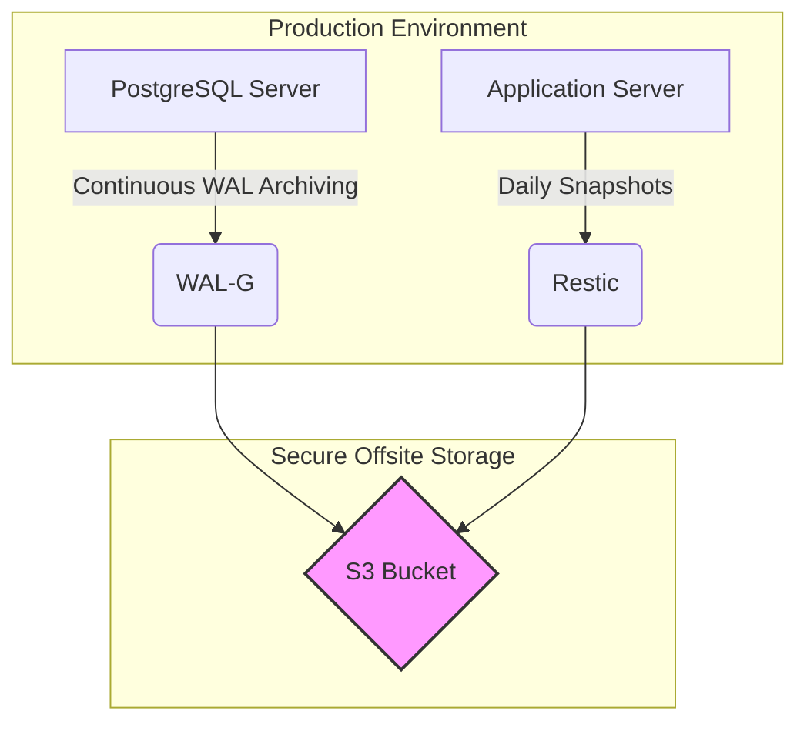

# 📦 سیستم بکاپ و بازیابی Production

این مستند، معماری، راه‌اندازی و نگه‌داری سیستم بکاپ پروژه را تشریح می‌کند. هدف این سیستم، محافظت از داده‌های حیاتی (دیتابیس و فایل‌ها) در برابر انواع فجایع و تضمین تداوم کسب‌وکار است.

## 🎯 اهداف کلیدی

-   **RPO (Recovery Point Objective):** کمتر از ۵ دقیقه. (حداکثر داده‌ای که از دست می‌دهیم)
-   **RTO (Recovery Time Objective):** کمتر از ۱ ساعت. (حداکثر زمان برای بازیابی کامل)

## 🏗️ معماری

معماری این سیستم بر پایه جداسازی کامل و امنیت طراحی شده است. بکاپ‌ها از سرورهای Production به یک **Object Storage** امن (مانند AWS S3) به‌صورت رمزنگاری‌شده ارسال می‌شوند. اپلیکیشن به هیچ‌وجه به کلیدهای بکاپ دسترسی ندارد.



## 🛠️ اجزاء و ابزارها

### ۱. بکاپ دیتابیس (PostgreSQL)

-   **ابزار:** `WAL-G`
-   **استراتژی:**
    -   **Point-in-Time-Recovery (PITR):** تمام تغییرات دیتابیس (`WAL`ها) به‌محض نوشته شدن، به‌صورت مداوم به S3 ارسال می‌شوند. این کار `RPO` را به چند دقیقه کاهش می‌دهد.
    -   **Full Base Backup:** یک بکاپ کامل از کل دیتابیس به‌صورت روزانه گرفته می‌شود تا نقطه شروعی برای بازیابی باشد.
-   **کانفیگ:** `config/walg_config.json`
-   **اسکریپت:** `scripts/run_db_backup.sh`

### ۲. بکاپ فایل‌ها (Media Assets)

-   **ابزار:** `Restic`
-   **استراتژی:**
    -   **Incremental & Deduplicated:** بکاپ‌ها به‌صورت افزایشی هستند (فقط تغییرات جدید ارسال می‌شوند) و با استفاده از Deduplication، از ذخیره داده‌های تکراری جلوگیری می‌شود که حجم و هزینه را کاهش می‌دهد.
    -   **End-to-End Encryption:** تمام فایل‌ها قبل از خروج از سرور با یک رمز عبور قوی رمزنگاری می‌شوند.
-   **کانفیگ:** از طریق متغیرهای محیطی (`.env`)
-   **اسکریپت:** `scripts/run_files_backup.sh`

---

## 🚀 راه‌اندازی اولیه

1.  **نصب ابزارها:**
    *   مطمئن شوید `wal-g`, `restic` و `jq` روی سرورهای مربوطه نصب هستند.

2.  **پیکربندی PostgreSQL:**
    *   برای فعال‌سازی PITR، فایل `postgresql.conf` را ویرایش کرده و مقادیر زیر را تنظیم کنید:
        ```ini
        archive_mode = on
        archive_command = 'wal-g wal-push %p'
        archive_timeout = 60
        ```
    *   پس از تغییر، سرویس PostgreSQL را `reload` کنید.

3.  **تنظیم متغیرهای محیطی:**
    *   یک فایل در مسیر `/etc/backup.env` ایجاد کرده و تمام کلیدهای دسترسی و رمزهای عبور را طبق نمونه در `config/backup.cron` در آن قرار دهید.
    *   **مهم:** دسترسی این فایل را به `600` محدود کنید: `chmod 600 /etc/backup.env`.

4.  **مقداردهی اولیه Restic:**
    *   برای اولین بار، اسکریپت بکاپ فایل‌ها را به‌صورت دستی اجرا کنید تا مخزن Restic ساخته شود:
        ```bash
        . /etc/backup.env; /usr/local/bin/run_files_backup.sh
        ```

5.  **ایجاد اولین Base Backup دیتابیس:**
    *   اسکریپت بکاپ دیتابیس را نیز برای اولین بار دستی اجرا کنید:
        ```bash
        . /etc/backup.env; /usr/local/bin/run_db_backup.sh
        ```

6.  **زمان‌بندی Cronjob:**
    *   فایل `config/backup.cron` را بررسی کرده و پس از اطمینان از صحت مسیرها و متغیرها، آن را به `crontab` کاربر `root` اضافه کنید:
        ```bash
        crontab /path/to/project/backup/config/backup.cron
        ```

---

## 🚑 بازیابی در مواقع اضطراری

برای بازیابی کامل سیستم، سند **[📖 Runbook: Disaster Recovery](./docs/RESTORE_RUNBOOK.md)** را به‌دقت و گام‌به‌گام دنبال کنید.

## 📊 مانیتورینگ

-   **لاگ‌ها:** خروجی اجرای اسکریپت‌های بکاپ در مسیرهای `/var/log/backup_db.log` و `/var/log/backup_files.log` ذخیره می‌شود. این فایل‌ها را به‌صورت دوره‌ای بررسی کنید.
-   **ابزارهای خارجی:** برای مانیتورینگ خودکار، پیشنهاد می‌شود از سرویس‌هایی مانند [Healthchecks.io](https://healthchecks.io/) یا [Uptime Kuma](https://github.com/louislam/uptime-kuma) استفاده کنید. این ابزارها می‌توانند در صورت عدم اجرای موفق یک `cronjob` به شما اطلاع‌رسانی کنند.

## 🔐 ملاحظات امنیتی

-   **IAM Policy:** کاربر IAM استفاده‌شده برای بکاپ، دارای حداقل دسترسی‌های ممکن است و اجازه `DeleteObject` ندارد.
-   **Immutable Storage:** پیشنهاد می‌شود قابلیت `Object Lock` را روی S3 Bucket فعال کنید تا از حذف تصادفی یا مخرب بکاپ‌ها جلوگیری شود.
-   **Encryption:** هر دو نوع بکاپ (دیتابیس و فایل) به‌صورت End-to-End رمزنگاری می‌شوند.
