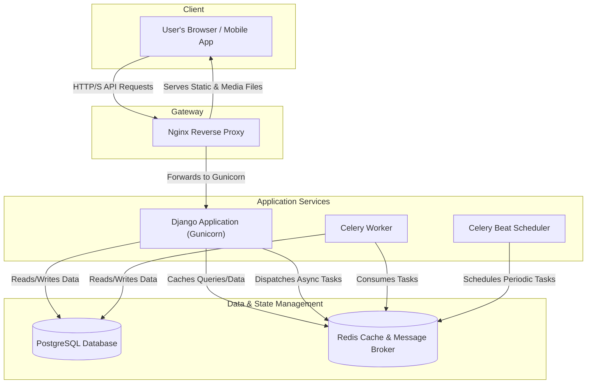

# High-Level Architecture Diagram

This diagram illustrates the high-level architecture of the Hypex E-commerce API, showing the interaction between its various components.

## Component Descriptions

-   **Client**: Represents the end-user's device (e.g., a web browser or mobile application) that interacts with the API.
-   **Nginx**: Acts as a reverse proxy. It receives all incoming traffic, serves static and media files directly for efficiency, and forwards API requests to the Django application server (Gunicorn).
-   **Web (Django/Gunicorn)**: The core of the application. It handles business logic, processes API requests, and interacts with the database and cache. Gunicorn is the WSGI server that runs the Django application.
-   **Database (PostgreSQL)**: The primary relational database used for persistent data storage, such as user information, products, and orders.
-   **Cache (Redis)**: An in-memory data store used for two main purposes:
    1.  **Caching**: To store frequently accessed data, reducing database load and speeding up responses.
    2.  **Message Broker**: To facilitate communication between the web application and Celery workers for background task processing.
-   **Celery Worker**: A separate process that runs in the background to execute long-running or asynchronous tasks (e.g., sending emails, processing images). This prevents API requests from being blocked.
-   **Celery Beat**: A scheduler that triggers periodic tasks at defined intervals (e.g., daily cleanup jobs or generating reports).
